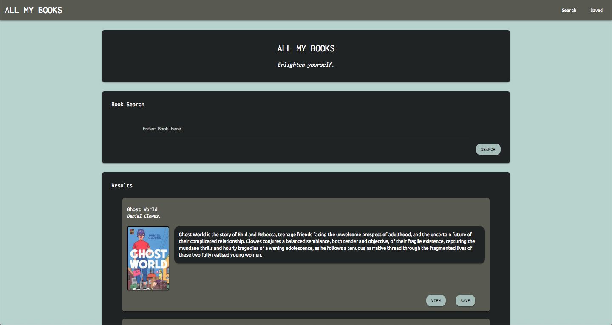

# All My Books 📚

_All My Books_ is a full-stack application that searches, saves, and deletes books of interest using the Google Books API. The app is built with React, MongoDB, Express and Node.js.

## Getting Started

The following instructions will get you a copy of the project up and running on your local machine for development and testing purposes.

### Installation

Please clone and download this folder to your hard disk. You will then navigate to the folder and run `npm install` or `yarn`. This will install the `react`, `react-dom`, `react-router-dom`, `axios`, `express`, `mongoose`, `dot-env`, and `react-scripts` dependencies.

You will then need to run your local `mongodb` server and include your API key in a `.env` file.

To connect to the server, type `yarn start` or `npm start`. Open your favorite browser and visit `localhost:3000` in your browser to view the client side and `localhost:3001` to view server side.

## Functionality

This app uses React to contact the Google Books API and render the user's search query to the page. This will dynamically display a list of books with their title, authors, thumbnail image, and description. The user will have the option to save a book. If saved, the book is sent to a MongoDB database. When the user navigates to the "saved" page, they will be able to view all of their books loaded via `express` and `mongoose.` The user may delete a book if they no longer wish to save it.

🚀 Deployed at: https://all-my-books.herokuapp.com/

## Built With

- React
- React Router
- Axios
- MongoDB
- Express
- Mongoose
- Node.js
- CSS Flexbox
